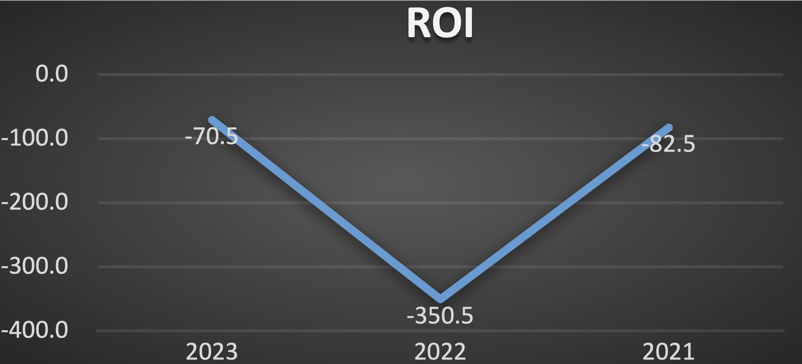
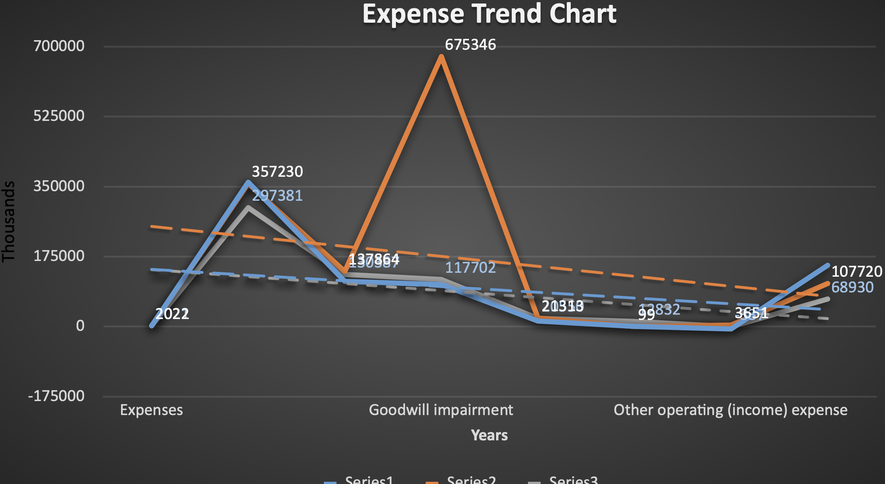

# Aveanna Healthcare

Aveanna Healthcare is a leading national provider of home healthcare services in the United States. 
The company offers a wide range of services primarily focused on pediatric and adult patients, including home health nursing, therapy, medical solutions, and services for medically fragile children.
Aveanna Healthcare's goal is to support patients with complex medical needs by offering comprehensive and individualized care plans that enhance their quality of life and enable them to remain in their homes.

## Analysis 
The analysis of this project is outlined in details in the financial report within the file above.
Although the report includes ROI, Current Ratios, Debt to Equity Ratios, Net Profit Margin and Gross profit Margin, the read me will display ROI only.

#Return on Investment:
Aveanna Healthcare is grappling with challenges in achieving a positive net profit. 
Analysis of its Return on Investment (ROI) reveals a consistently negative trend, primarily stemming from annual net losses detailed in its Profit and Loss statement.
Particularly notable was the significant net loss of $662 million in 2022, marking a particularly challenging financial year for the company. 
This substantial loss was predominantly attributed to a $675 million Goodwill impairment.

In 2022, the company incurred two impairment charges due to ongoing inflationary pressures and escalating overall costs, which hindered patient volume growth 
in relation to expenses across various business segments. Despite lower investment levels in 2022 compared to 2023, the company still faced a substantial net loss,
resulting in a negative ROI of (350.5). While ROI remained negative in subsequent years due to continued net losses, there is potential for improvement and a 
pathway to profitability with effective management strategies.

## Expense Trends 
The expense trend over the past three years has shown an annual increase, with fluctuations. In 2022, there was a significant surge in goodwill impairment expenses, 
totaling $675,346, compared to $117,702 in 2021 and $105,136 in 2023. Depreciation and amortization decreased from $21.3 million in 2022 to $13.8 million in 2023, 
primarily due to the full amortization of certain intangible assets acquired in previous years. Acquisition-related costs include expenses related to planned, 
finalized, or terminated acquisitions. Net interest expense increased from $107.0 million in 2022 to $152.9 million in 2023, largely due to rising interest rates 
and increased borrowing on the Securitization Facility.

## Recommendation 
Based on the challenges outlined for Aveanna Healthcare, several recommendations can be proposed to address these issues and improve the company's financial stability:

>- Cost Management:
Implement rigorous cost management strategies to mitigate the impact of elevated cost of revenue. This may involve identifying areas of inefficiency, renegotiating contracts 
with suppliers, and streamlining operational processes to optimize resource utilization.

>- Diversification of Revenue Streams: 
Reduce reliance on debt financing by diversifying revenue streams and exploring alternative sources of funding. This could involve expanding service offerings, 
entering new markets, or exploring partnerships and collaborations with other healthcare businesses to generate additional income streams.

>- Debt Management: 
Develop a comprehensive debt management plan to reduce the company's reliance on debt financing and minimize associated risks. This may include refinancing existing debts 
at more favorable terms, restructuring debt obligations, and actively managing debt levels to ensure they are sustainable in the long term.

>- Management and Governance: 
Address underlying issues related to poor management practices and unsuccessful policies by enhancing corporate governance mechanisms and implementing measures to improve 
management effectiveness. This could involve restructuring management teams, enhancing accountability and transparency, and fostering a culture of continuous improvement and 
innovation.

## Assumptions
The only are where are some assumptions made in Sensitivity Analysis. Following are the assumptions made:
>- Other things remain constant includes all the costs of revenue, operating costs, interest expenses and taxation.
>- Interest Expense is analyzed by taking Weighted Average Interest Rate in all three years.

## Limitations
The sensitivity analysis was based on assumptions and does not present the true picture of the company’s position. When we assumed a change in a variable like revenue, 
we ignore the effects of other variables which also effects the income statement.
